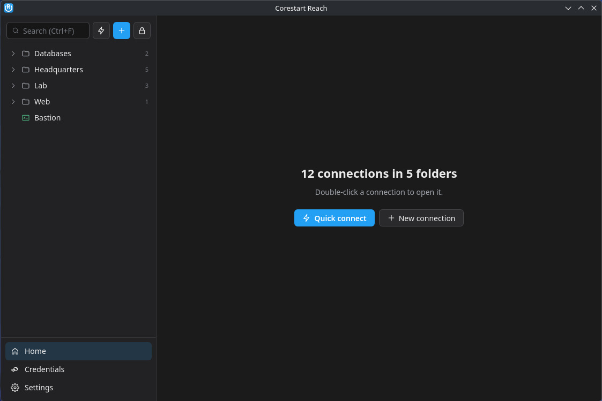
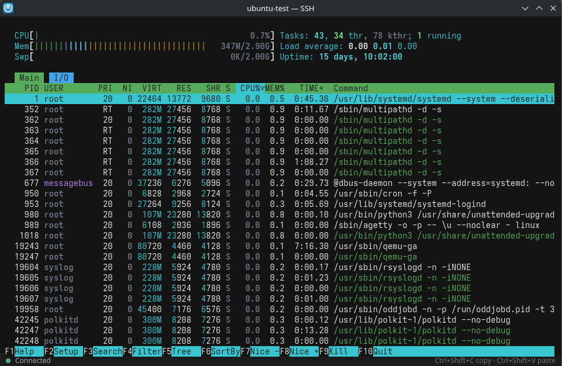
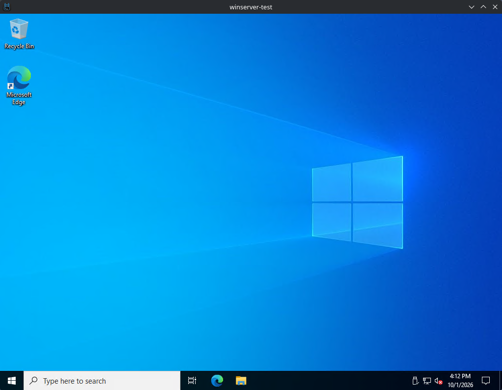
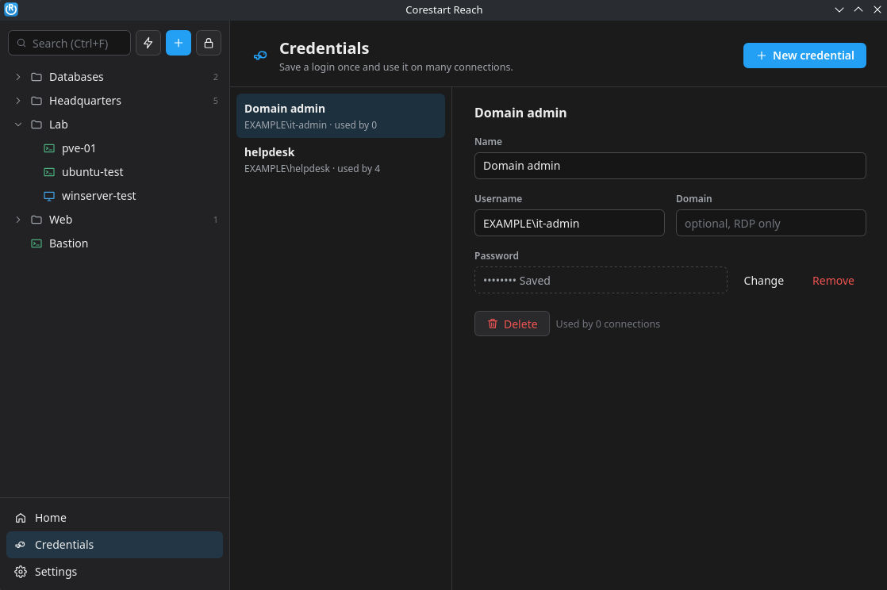
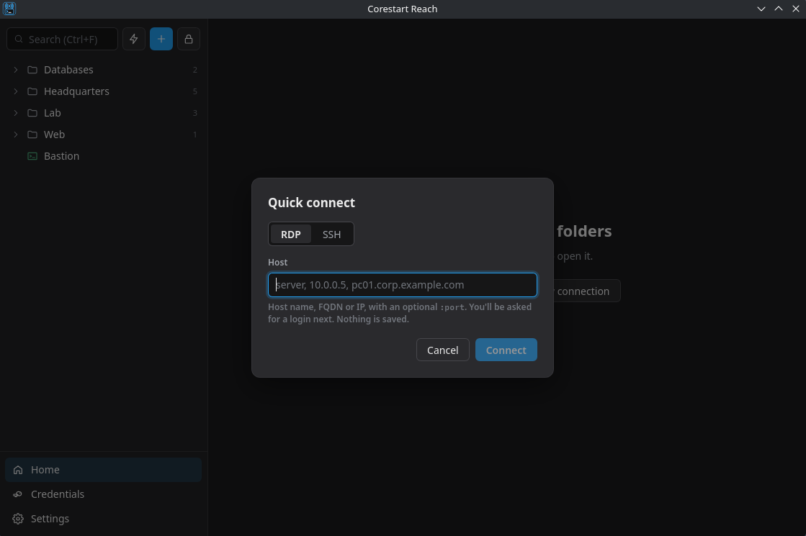

# Corestart Reach

A simple, modern RDP and SSH connection manager for Windows and Linux, in the spirit of
mRemoteNG and Royal TS. Free and open source under GPL-3.0.

[](https://github.com/sponsors/ThePoolboy)
[](https://ko-fi.com/thepoolboy)



<table>
  <tr>
    <td></td>
    <td></td>
  </tr>
  <tr>
    <td></td>
    <td></td>
  </tr>
</table>

- **Everything encrypted**: every host, username, password and note is kept in one file that
  nothing can read without your master password.
- **RDP** opens in your system's own client: `mstsc` on Windows, FreeRDP on Linux.
  Saved passwords are passed along, so you're logged straight in. Use a window the remote
  desktop follows, a fixed screen size, or full screen.
- **SSH** opens in its own terminal window. Logs in with a saved password, a key file,
  your ssh-agent or your usual `~/.ssh` keys, or keyboard-interactive / 2FA prompts.
  Host keys are checked against `~/.ssh/known_hosts`, the same file OpenSSH uses.
- **Quick connect** to any host without saving it (Ctrl+K).
- **Saved credentials**: store a login once (e.g. a domain admin) and use it on many
  connections. Change the password in one place.
- Folders with drag and drop, right-click menus, search, keyboard shortcuts you can change,
  light and dark themes.

## Status

Early development (0.2), ready for testing. RDP and SSH each open in their own window.
Planned: import from mRemoteNG, tabs and embedded RDP.

Tested on Windows 11, Fedora 44 Workstation, Fedora 44 KDE Plasma Desktop, Ubuntu Desktop
26.04 and Linux Mint 22.3 Cinnamon. The Flatpak should also run on other Linux
distributions.

Reach **locks itself after 15 minutes without use** (change it or turn it off in
**Settings → Security**). Open RDP and SSH sessions keep running when it locks. The master
password can be changed there too; your saved data and its backup are re-encrypted with the
new one.

## Install

An **installer** for Windows and a **Flatpak** for every Linux distribution (FreeRDP
included). Both keep themselves up to date.

| System | Install |
| --- | --- |
| Windows 10 / 11 | Download `Corestart-Reach_<version>_x64-setup.exe` from the [**latest release**](https://github.com/ThePoolboy/corestart-reach/releases/latest) and run it. Install it just for you (no admin rights needed) or, as an admin, for everyone on the computer. |
| Linux | Open **[thepoolboy.github.io/corestart-reach](https://thepoolboy.github.io/corestart-reach/)** and click **Install**, or run `flatpak install --user https://thepoolboy.github.io/corestart-reach/corestart-reach.flatpakref` |

- **Windows** shows "Windows protected your PC" the first time, because Reach isn't
  code-signed yet. Click **More info → Run anyway**. After that Reach updates itself (see
  [Updates](#updates)).
- **Everyone on a Windows computer:** choose "Anyone who uses this computer" in the installer, or
  install silently from an admin command prompt with `Corestart-Reach_<version>_x64-setup.exe /S /AllUsers`.
  Each user still has their own connections. Updates then need an admin's approval.
- **Linux:** the `.flatpak` file on each release installs the same way
  (`flatpak install --user ./Corestart-Reach_<version>_x86_64.flatpak`) and also receives
  updates, from version 0.1.1 on. Fedora and Linux Mint have Flatpak and Flathub set up
  already. **Ubuntu** needs it once:
  ```bash
  sudo apt install flatpak
  flatpak remote-add --user --if-not-exists flathub https://dl.flathub.org/repo/flathub.flatpakrepo
  ```
  then log out and back in. The first install downloads the GNOME runtime Reach needs from
  Flathub. Start Reach from the app menu, or with `flatpak run io.github.thepoolboy.corestart-reach`.

The Flatpak's permissions and how it's built are described in [flatpak/README.md](flatpak/README.md).

Test builds of every change are under the repository's
[**Actions**](https://github.com/ThePoolboy/corestart-reach/actions) tab: pick the latest
green **Build** run and download from **Artifacts** at the bottom (you need to be signed in
to GitHub). See [TESTING.md](TESTING.md).

## How your data is stored

| | |
| --- | --- |
| Data file (Flatpak) | `~/.var/app/io.github.thepoolboy.corestart-reach/data/io.github.thepoolboy.corestart-reach/vault.json` (owner-only, 0600) |
| Data file (Linux, built from source) | `~/.local/share/io.github.thepoolboy.corestart-reach/vault.json` |
| Data file (Windows) | `%APPDATA%\io.github.thepoolboy.corestart-reach\vault.json` |
| Key derivation | Argon2id, 64 MiB memory, 3 passes, random 16-byte salt |
| Encryption | XChaCha20-Poly1305, fresh random nonce on every save |
| Backup | The previous version is kept as `vault.json.bak` on every save |
| Settings | Inside the encrypted data file (Settings → About shows where it is) |
| SSH host keys | `~/.ssh/known_hosts`, shared with OpenSSH |

Passwords never reach the interface: it only knows whether one is saved. On Linux the
RDP password goes to FreeRDP through a pipe (`/args-from:stdin`), so it never appears in
the process list. On Windows it's stored as a session-only `TERMSRV/<host>` credential
for mstsc (what `cmdkey` does), and Windows clears it when you sign out.

**There is no password recovery.** If you forget the master password, your saved
connections can't be opened.

Reach sends nothing anywhere except the RDP and SSH connections you open: no telemetry, no
accounts. The one exception is the update check on Windows (see [Updates](#updates)). To report a security problem privately, see [SECURITY.md](SECURITY.md). Changes
in each version are in [CHANGELOG.md](CHANGELOG.md).

Only one copy of Reach runs at a time; starting it again brings the open one forward.

## Updates

- **Windows:** Reach checks GitHub for a new version after you unlock it and every 12 hours.
  When there is one, a bar at the top offers **Update and restart**. Nothing is installed
  until you click it. The check downloads a small `latest.json` file from this repository's
  newest release and sends nothing about you or your connections. Turn it off in
  **Settings → Updates**, or check by hand with **Check now**. Reach only installs an update
  carrying the project's updater signature.
- **Linux:** Reach's own Flatpak repository, on this project's GitHub Pages site, gets each
  new release when it's published. Your software center (Discover, GNOME Software) or
  `flatpak update` installs it like any other update. Releases there are signed with the
  project's [repository key](https://thepoolboy.github.io/corestart-reach/corestart-reach.gpg).
  Reach itself doesn't check for updates on Linux.

## Keyboard shortcuts

| Keys | Action |
| --- | --- |
| Ctrl+K | Quick connect |
| Ctrl+N | New connection |
| Ctrl+F | Search (Enter connects to the first match, or quick connects if none) |
| Ctrl+L | Lock Reach |
| Ctrl+, | Settings |
| Ctrl+S | Save the open connection |
| ↑ ↓ ← → / Enter | Move through the tree / connect |
| Shift+F10 or Menu key | Right-click menu for the selected item |
| Ctrl+Shift+C / Ctrl+Shift+V | Copy / paste in an SSH window |

The first six are the defaults. Change them in **Settings → Keyboard shortcuts**: click one and
press the new keys.

## Building from source

You need Rust (via [rustup](https://rustup.rs)), Node.js 20+ and WebKitGTK on Linux.
Running from source on Linux uses your system's FreeRDP 3 for RDP.

```bash
# Fedora
sudo dnf group install c-development && sudo dnf install nodejs webkit2gtk4.1-devel freerdp
# Ubuntu / Debian
sudo apt install build-essential nodejs npm libwebkit2gtk-4.1-dev freerdp3-x11
```

Windows needs the "Desktop development with C++" workload from Visual Studio Build Tools.

```bash
npm install
npm run tauri dev                          # run with live reload
npm run tauri build                        # Windows: setup.exe in src-tauri/target/release/bundle/nsis
npm run check                              # type-check the interface
cd src-tauri && cargo clippy && cargo test # lint and test the Rust core
```

For screenshots, `npm run demo-vault` fills a data file with made-up connections (master
password `demo-password`). On Linux, run it and the app with the same `XDG_DATA_HOME` to keep
the sample apart from your own connections:

```bash
XDG_DATA_HOME=/tmp/reach-shots npm run demo-vault
XDG_DATA_HOME=/tmp/reach-shots npm run tauri dev
```

It never overwrites an existing file. Set `REACH_DEMO_VAULT` to a file path to fill another
location, such as the Flatpak's.

The Flatpak is built with flatpak-builder; see [flatpak/README.md](flatpak/README.md).

Every push to `main` runs the checks and builds the Flatpak and the Windows installer on
GitHub ([`.github/workflows/build.yml`](.github/workflows/build.yml)).

## Project layout

```
src/                        interface (Svelte 5 + TypeScript)
  main.ts                   picks the main window or an SSH window from the URL
  lib/api.ts                typed wrappers for every Rust command
  lib/desktop.ts            turns off web-page behaviour (browser menu, F5 reload)
  lib/shortcuts.ts          keyboard shortcuts and their defaults
  views/Workspace.svelte    sidebar tree, drag and drop, menus, panes
  views/SshSession.svelte   terminal window (xterm.js)
src-tauri/                  Rust core (Tauri 2)
  src/vault.rs              the encrypted data file
  src/model.rs              connections, folders, credentials
  src/rdp.rs                launch FreeRDP / mstsc
  src/ssh.rs                SSH sessions (russh)
  src/commands.rs           commands the interface calls
  src/update.rs             Windows self-update from GitHub Releases
flatpak/                    Flatpak recipe, app menu entry and store listing
```

## Known issues

- **NVIDIA on Wayland:** WebKitGTK's DMA-BUF renderer crashes with
  `Error 71 (Protocol error) dispatching to Wayland display`. Reach turns it off at
  start-up (`WEBKIT_DISABLE_DMABUF_RENDERER=1`). Set the variable to `0` yourself to
  override.
- **Windows with Credential Guard** (on by default on some Windows 11 Enterprise and
  Education machines) can refuse saved RDP credentials. mstsc then asks for the password
  itself.
- **FreeRDP 2 isn't supported** when running from source: Reach needs FreeRDP 3 to pass the
  password privately. The Flatpak includes FreeRDP 3.
- **RDP in the Flatpak** uses FreeRDP's SDL3 client, which runs natively on Wayland (X11 on
  X11 desktops). Running from source uses your distribution's FreeRDP client instead.

## Support Reach

Reach is free and always will be: no paid edition, no ads, no locked features. If it saves
you time, you can help keep it going. Donations are optional and don't unlock anything.

- **[GitHub Sponsors](https://github.com/sponsors/ThePoolboy)**: monthly or one-off, with your GitHub account.
- **[Ko-fi](https://ko-fi.com/thepoolboy)**: one-off or monthly, by card or PayPal.
- **Crypto**: scan a code or copy the address. Check the address in your wallet before
  sending; crypto payments can't be reversed.

| Bitcoin (BTC) | Ethereum (ETH) |
| :---: | :---: |
|  |  |
| `bc1qrwfpl77k7zfgrea8suv78cxn8wp3lvn3mjumz0` | `0xB968531aa4f6EaE2c2c479B56b111c8B3B5c6C54` |

The same links are in Reach under **Settings → Support Reach**. Starring the repository,
reporting bugs and telling others about Reach help too.

## Code signing policy

Free code signing provided by [SignPath.io](https://about.signpath.io), certificate by
[SignPath Foundation](https://signpath.org).

Only the Windows downloads on the [Releases](https://github.com/ThePoolboy/corestart-reach/releases)
page are signed: the installer and the Reach program inside it. They are built by
GitHub Actions from the tagged commit in this repository, and nothing built anywhere else
is signed. Test builds from the Actions tab aren't signed.

| Role | Members |
| --- | --- |
| Committers and reviewers | [ThePoolboy](https://github.com/ThePoolboy) |
| Approvers | [ThePoolboy](https://github.com/ThePoolboy) |

Committers can change the source directly. Changes from anyone else are reviewed by a
reviewer before they're merged. An approver checks and approves every signing request.

**Privacy:** This program will not transfer any information to other networked systems
unless specifically requested by the user or the person installing or operating it. The
only connections Reach makes are the RDP and SSH sessions you open; on Windows, the update
check described under [Updates](#updates), which can be turned off in Settings; and the
Support Reach links, which open in your browser only when you click them.

## License

Corestart Reach is free software under the [GNU General Public License v3.0](LICENSE).
Anyone may use, study, share and change it. Copies you distribute must stay under the
same license, with source code.

"Corestart", "Corestart Reach" and the Corestart logo are names and marks of Corestart
Networks. Forks are welcome under the GPL, but please give them a different name and logo
so nobody confuses them with the official project.

## Contributors

- **[ThePoolboy](https://github.com/ThePoolboy)**: project owner
- **Claude** (Anthropic's AI assistant): co-author of code and documentation

Claude's work shows in the history either as the commit author or as a
`Co-Authored-By: Claude` line on the commit.
